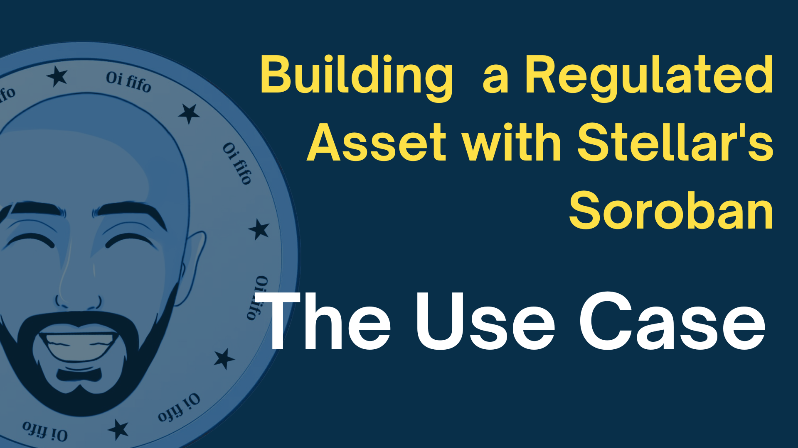

# Oi Fifo - Stellar Soroban Use Cases

<table align="center" border="0">
<tr>
<td></td>
<td></td>
</tr>
</table>

A collection of various use cases implemented on Stellar's smart contract platform, Soroban.

## Use Cases

### Classic Asset Wrapper

The Classic Asset Wrapper is an approach that aims towards extending classic assets through soroban smart contracts.

Currently, classic assets can already be wrapped in SAC(Stellar Asset Contracts) which are native default contracts that provide a Soroban interface for those assets. These provide with the same key functionalities and behaviors as you'd expect from these assets but accessible in a standardized way following the standard token interface.

Even though this allows for the asset to be integrated in numerous use cases, there is still room for more flexibility since the SACs are not customizable by design. With this in mind the Classic Asset Wrapper can be used in two main ways:

- **Soft Wrapper**: Provides with an alternative entry point to interact with the asset. This approach is flexible and let's the user and applications decide if they want to leverage the additional programmability provided by the wrapper or not. This can be used in use cases such as:

  - **A rewards program** in which user opt to participate and receive points or cash-back when interacting with the asset.
  - **Use a curated safety whitelist** of applications tha this asset issuer recommends / trusts. Blocking applications that aren't a part of it.

- **Hard Wrapper**: Replaces the SAC and classic as entry points to interact with this asset, ensuring that all asset holders can only interact with the asset by the implemented rules. This is achieved by a combination of control flags and temporary authorizations managed in contract executions. This is similar to the [SEP08 - Regulated Assets](https://github.com/stellar/stellar-protocol/blob/master/ecosystem/sep-0008.md) standard but managed within Soroban instead of an external server. This can be used in use cases such as:
  - **A Regulated Asset** that applies certain limits for accounts in case they haven't been approved by the issuer. This could be tied to a KYC process to ensure that accounts tha't haven't been KYC'd can't transact too often or specific amounts within certain time windows.
  - **Enforce a whitelist** with only specific dApps being allowed by the asset issuer.
  - **Define different tiers of users** for a product token. Depending on your customer tier you might have certain limits and features locked, up to a point where a premium user being fully approved and able to use the asset freely.

This might initially sound like a pure smart contract asset with just extra steps but in reality it aims at allowing for very flexiblae hybrid assets. This ensures that Soroban's programmability can be leveraged wherever necessary to bring flexibility and additional security as well as classic and all of its key strenghts when the objective is to perform fast, cheap and easy-to-integrate transactions.

#### Contracts

The following items can be found in this repository for the Classic Asset Wrapper use case:

- **Enforced Classic Wrapper contract** `contracts/classic-asset-wrapper-enforced`: An implementation of a classic wrapper that is mandatory and eforces the rules applied by its defined asset controller.
- **Optional Classic Wrapper contract** `contracts/classic-asset-wrapper-optional`: An implementation of a classic wrapper that is optional and simply extends a transfer by executing the asset controller logic prior to a transfer.
- **Asset Controller contract(probation)** `contracts/asset-controller`: An eforced ruleset to apply a probation period to asset holders and customizable rules.
- **Campaign contract** `contracts/campaign`: A campaign that distributes funds based on asset usage and customizable points criteria.

-**standard-traits** `contracts/standard-traits`: A crate with traits and common functions for Classic Wrapper implementations.

#### Playing around

To deploy, integrate and play with this use case directly, see the playground project under `playground/classic-asset-wrapper`. A fully interactive demo can also be found at [oififo.com/demos/classic-wrapper](https://www.oififo.com/demos/classic-wrapper)

### Regulated Asset ([Access](contracts/regulated-token/README.md))

Regulated Assets are those that mandate the issuer's (or an authorized third party’s, such as a licensed securities exchange) approval for every transaction. Certain regulations require asset issuers to monitor and approve every transaction involving their assets, ensuring specific constraints are met. The Stellar ecosystem, as defined in [SEP08 - Regulated Assets](https://github.com/stellar/stellar-protocol/blob/master/ecosystem/sep-0008.md), offers an approach that capitalizes on Stellar Classic's capabilities. Drawing inspiration from SEP08 standards, this use case enriches a token contract with an auxiliary asset controller contract, allowing the asset issuer to enforce tailored rules programmatically.

    

The hosted demo can be accessed at: [oififo.com/demos/regulated-asset](https://www.oififo.com/demos/regulated-asset)
